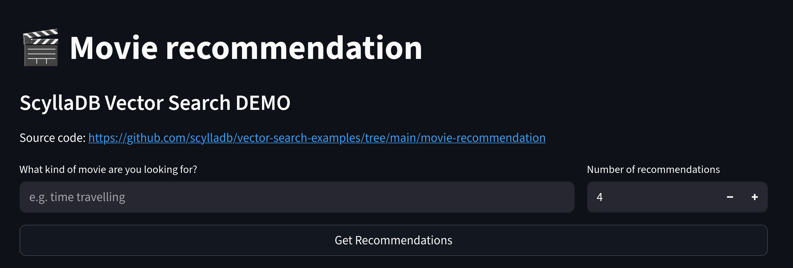
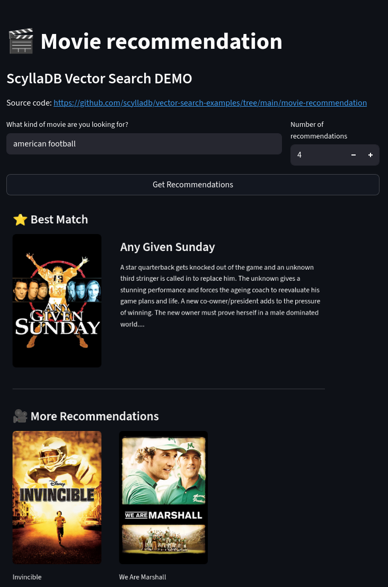

# Build a movie recommendation app with ScyllaDB

This tutorial shows you how to build a vector search application with ScyllaDB.

You'll build a simple movie recommendation app that takes a text input from the user and performs vector search to recommend a movie to watch.

Source code is [available on GitHub](https://github.com/scylladb/vector-search-examples/tree/main/movie-recommendation).

## Prerequisites
* [ScyllaDB Cloud account](https://cloud.scylladb.com/)
* [Python 3.9 or newer](https://www.python.org/downloads/)

## Install Python requirements
1. Create and activate a new Python virtual environment (you can use [virtualenv](https://virtualenv.pypa.io/en/latest/), [Poetry](https://python-poetry.org/docs/), [venv](https://docs.python.org/3/library/venv.html) or any other environment management library):
    ```
    virtualenv env && source env/bin/activate
    ```
1. Install requirements:
    ```sh
    pip install scylla-driver pydantic sentence-transformers streamlit
    ```
    This installs:
    * **ScyllaDB Python driver**: needed for ScyllaDB
    * **Pydantic**: to validate data and handle objects
    * **Sentence Transformers**: to create embedding from text
    * **Streamlit**: to build a simple UI

## Set up ScyllaDB as a vector store
1. Create a new ScyllaDB Cloud instance with `vector search` enabled.
1. Create `config.py` and add your database connection details (host, username, password, etc...):
    ```py
    SCYLLADB_CONFIG = {
        "host": "node-0.aws-us-east-1.xxxxxxxxxxx.clusters.scylla.cloud",
        "port": "9042",
        "username": "scylla",
        "password": "passwd",
        "datacenter": "AWS_US_EAST_1"
    }
    ```
1. Create a helper module called `scylladb.py` to insert data and query results from ScyllaDB:
    ```py
    from cassandra.cluster import Cluster, ExecutionProfile, EXEC_PROFILE_DEFAULT
    from cassandra.policies import DCAwareRoundRobinPolicy, TokenAwarePolicy
    from cassandra.auth import PlainTextAuthProvider
    from cassandra.query import dict_factory
    import sys, os
    import config

    class ScyllaClient():
        def __init__(self, keyspace: str = None):
            self.cluster = self._get_cluster(config.SCYLLADB_CONFIG)
            if keyspace:
                self.session = self.cluster.connect(keyspace)
            else:
                self.session = self.cluster.connect()
            
        def __enter__(self):
            return self
        
        def __exit__(self, exc_type, exc_value, traceback):
            self.shutdown()
            
        def shutdown(self):
            self.cluster.shutdown()

        def _get_cluster(self, config: dict) -> Cluster:
            profile = ExecutionProfile(
                load_balancing_policy=TokenAwarePolicy(
                        DCAwareRoundRobinPolicy(local_dc=config["datacenter"])
                    ),
                    row_factory=dict_factory
                )
            return Cluster(
                execution_profiles={EXEC_PROFILE_DEFAULT: profile},
                contact_points=[config["host"], ],
                port=config["port"],
                auth_provider = PlainTextAuthProvider(username=config["username"],
                                                    password=config["password"]))
        
        def print_metadata(self):
            for host in self.cluster.metadata.all_hosts():
                print(f"Datacenter: {host.datacenter}; Host: {host.address}; Rack: {host.rack}")
        
        def get_session(self):
            return self.session
        
        def insert_data(self, table, data: dict):
            columns = list(data.keys())
            values = list(data.values())
            insert_query = f"""
            INSERT INTO {table} ({','.join(columns)}) 
            VALUES ({','.join(['%s' for c in columns])});
            """
            self.session.execute(insert_query, values)
            
        def query_data(self, query, params=[]):
            rows = self.session.execute(query, params)
            return rows.all()
    ```
1. Create `schema.cql`. This script creates a keyspace, a table for movies, and a vector index for similarity search in ScyllaDB:
    ```
    CREATE KEYSPACE recommend WITH replication = {'class': 'NetworkTopologyStrategy', 'replication_factor': '3'}
    AND TABLETS = {'enabled': 'false'};

    CREATE TABLE recommend.movies (
        id INT,
        release_date TIMESTAMP,
        title TEXT,
        tagline TEXT,
        genre TEXT,
        imdb_id TEXT,
        poster_url TEXT,
        plot TEXT,
        plot_embedding VECTOR<FLOAT, 384>,
        PRIMARY KEY (id)
    ) WITH cdc = {'enabled': 'true'};


    CREATE INDEX IF NOT EXISTS ann_index ON recommend.movies(plot_embedding) 
    USING 'vector_index'
    WITH OPTIONS = { 'similarity_function': 'DOT_PRODUCT' };
    ```
1. Create and run `migrate.py` script:
    ```py
    import os
    from scylladb import ScyllaClient

    client = ScyllaClient()
    session = client.get_session()

    def absolute_file_path(relative_file_path):
        current_dir = os.path.dirname(__file__)
        return os.path.join(current_dir, relative_file_path)

    print("Creating keyspace and tables...")
    with open(absolute_file_path("schema.cql"), "r") as file:
        for query in file.read().split(";"):
            if len(query) > 0:
                session.execute(query)
    print("Migration completed.")

    client.shutdown()
    ```
## Build the vector search module
In this step, you'll build a simple Python module that finds similar movies based on the input text using ScyllaDB Vector Search.

ScyllaDB acts as a persistent storage for your embeddings and an efficient vector search tool.

1. Create a new Pydantic model in a new file called `models.py`:
    ```py
    from pydantic import BaseModel
    from datetime import datetime
    from typing import Optional

    class Movie(BaseModel):
        id: int
        title: Optional[str] = None
        release_date: Optional[datetime] = None
        tagline: Optional[str] = None
        genre: Optional[str] = None
        poster_url: Optional[str] = None
        imdb_id: Optional[str] = None
        plot: Optional[str] = None
        plot_embedding: Optional[list[float]] = None
    ```
1. Create the text embedding module, `embedding_creator.py`:
    ```py
    from sentence_transformers import SentenceTransformer

    class EmbeddingCreator:
        def __init__(self, model_name: str = 'all-MiniLM-L6-v2'):
            self.embedding_model = SentenceTransformer(model_name, device='cpu')
        
        def create_embedding(self, text: str) -> list[float]:
            """
            Get an embedding for a single text input using SentenceTransformer.
            Returns the embedding vector.
            """
            return self.embedding_model.encode(text).tolist()
    ```
1. Create a module that recommends similar movies using vector search. Call it `recommender.py`:
    ```py
    from db.scylladb import ScyllaClient
    from embedding_creator import EmbeddingCreator
    from models import Movie
        
    class MovieRecommender:
        def __init__(self):
            self.scylla_client = ScyllaClient()
            self.embedding_creator = EmbeddingCreator("all-MiniLM-L6-v2")
        
        def similar_movies(self, user_query: str, top_k=5) -> list[Movie]:
            db_client = ScyllaClient()
            user_query_embedding = self.embedding_creator.create_embedding(user_query)
            db_query = f"""SELECT *
                        FROM recommend.movies
                        ORDER BY plot_embedding ANN OF %s LIMIT %s;
                    """
            values = [user_query_embedding, top_k]
            results = db_client.query_data(db_query, values)
            return [Movie(**row) for row in results]
    ```

## Build Streamlit UI
At this point, you have all the building blocks needed to power a movie recommendation app. Let's build a user interface with Streamlit:

`app.py`:
```py
import streamlit as st
from recommender import MovieRecommender
from models import Movie

recommender = MovieRecommender()

st.set_page_config(
    page_title="Movie Recommender",
    page_icon="🎬",
    layout="wide"
)

# Header
st.title("🎬 Movie recommendation")
st.subheader("ScyllaDB Vector Search DEMO")
st.markdown("Source code: https://github.com/scylladb/vector-search-examples/tree/main/movie-recommendation")

# Input area
col1, col2 = st.columns([3, 1])
with col1:
    user_query = st.text_input("What kind of movie are you looking for?",placeholder="e.g. time travelling")
with col2:
    top_k = st.number_input("Number of recommendations", min_value=3, max_value=15, value=4, step=1)

search_button = st.button("Get Recommendations", width="stretch")

def show_poster(poster: str) -> str:
    if poster:
        base_url = "https://image.tmdb.org/t/p/original"
        url = f"{base_url}{poster}"
        st.image(url, width="content")
    else:
        st.caption("Poster not found")

def display_best_match(best_match: Movie):
    movie_poster = best_match.poster_url
    col1, col2 = st.columns([1, 2])
    with col1:
        show_poster(movie_poster)
    with col2:
        st.markdown(f"### {best_match.title}")
        st.write(best_match.plot[:500] + "...")
        
def display_more_recommendations(movies: list[Movie]):
    cols = st.columns(3)
    for i, movie in enumerate(movies[1:]):
        with cols[i % 3]:
            poster = movie.poster_url
            show_poster(poster)
            st.write(movie.title)


def display_search_results():
    with st.spinner("🔍 Searching for recommendations..."):
        movies = recommender.similar_movies(user_query, top_k)
        if movies:
            st.subheader("⭐ Best Match")
            best_match = movies[0]
            display_best_match(best_match)
            st.divider()
                
            st.subheader("🎥 More Recommendations")
            rest_of_the_movies = movies[1:]
            display_more_recommendations(rest_of_the_movies)
        else:
            st.error("❌ No similar movies found.")

if search_button:
    if not user_query:
        st.warning("⚠️ Please enter a movie to get recommendations.")
    else:
        try:
            display_search_results()
        except Exception as e:
            st.error(f"⚠️ Error: {str(e)}")

```

Go ahead and run streamlit:
```py
streamlit run app.py
```


## Insert sample data
Now that ScyllaDB is properly set up and your vector search module and Streamlit app are running smoothly, let's insert some sample data (100k movies from this [dataset](https://www.kaggle.com/datasets/asaniczka/tmdb-movies-dataset-2023-930k-movies/)) so you can start exploring your app.

Create a new file called `ingest.py`:
```py
import csv
from datetime import datetime
from db.scylladb import ScyllaClient
from embedding_creator import EmbeddingCreator

class MovieLoader:
    def __init__(self):
        self.scylla_client = ScyllaClient()
        self.embedding_creator = EmbeddingCreator("all-MiniLM-L6-v2")

    def create_embedding(self, text: str) -> list[float]:
        return self.embedding_creator.create_embedding(text)

    def ingest_csv(self, csv_file, table_name):
        with ScyllaClient() as client:
            with open(csv_file, encoding="utf-8") as f:
                reader = csv.DictReader(f)
                for row in reader:
                    data = {
                        "id": int(row["id"]),
                        "release_date": datetime.strptime(row["release_date"], "%Y-%m-%d"),
                        "title": row["title"],
                        "tagline": row["tagline"],
                        "genre": row["genres"],
                        "poster_url": row["poster_path"],
                        "imdb_id": row["imdb_id"],
                        "plot": row["overview"],
                        "plot_embedding": self.create_embedding(row["overview"]),
                    }
                    client.insert_data(table_name, data)


if __name__ == "__main__":
    CSV_FILE = "data/movies_sample.csv"
    loader = MovieLoader()
    print("⏳ Ingestion started...")
    loader.ingest_csv(CSV_FILE, "recommend.movies")
    print(f"✅ Finished ingesting {CSV_FILE}")
```

Start running this app and the database will get populated with movies:
```
python ingest.py

⏳ Ingestion started...
```



The complete application is available on [GitHub](https://github.com/scylladb/vector-search-examples/tree/main/movie-recommendation).

## Relevant resources
* [ScyllaDB Cloud](https://cloud.scylladb.com/)
* [ScyllaDB Documentation](https://docs.scylladb.com/)
