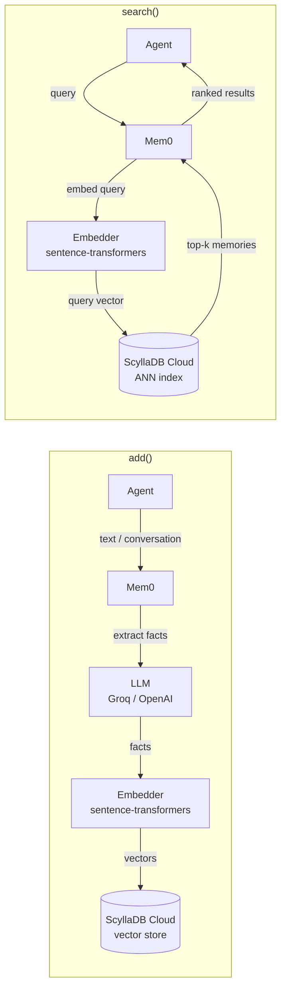

# mem0 + ScyllaDB Cloud example app

A minimal [mem0](https://github.com/mem0ai/mem0) demo that stores, searches, updates, and deletes user memories backed by **ScyllaDB Cloud** as the vector store.

## Requirements

| Requirement | Notes |
|---|---|
| Python ≥ 3.10 | |
| uv | `curl -LsSf https://astral.sh/uv/install.sh \| sh` |
| ScyllaDB Cloud cluster | Vector search must be enabled — [cloud.scylladb.com](https://cloud.scylladb.com) |
| Groq API key | LLM only — get one free at [console.groq.com](https://console.groq.com) |

> Embeddings are generated **locally** via `sentence-transformers/all-MiniLM-L6-v2` (~80 MB download on first run).

## ScyllaDB Cloud credentials

Retrieve the following from your cluster's **Connect** tab in the [ScyllaDB Cloud Console](https://cloud.scylladb.com):

- **Node address** — e.g. `node-0.your-cluster.cloud.scylladb.com`
- **Username / Password**
- **Datacenter name** — e.g. `AWS_US_EAST_1`

Store them in a `.env` file alongside `main.py`:

```dotenv
SCYLLADB_ADDRESS=node-0.your-cluster.cloud.scylladb.com
SCYLLADB_USERNAME=scylla
SCYLLADB_PASSWORD=your-password
SCYLLADB_DATACENTER=AWS_US_EAST_1
GROQ_API_KEY=gsk-...
```

## Schema setup

mem0 creates the table automatically, but the keyspace and vector index must exist first. Run the migration script (reads credentials from `.env`):

```bash
uv run migrate.py
```

This creates:
- Keyspace `mem0` (replication factor 3)
- Table `mem0.memories` with a `vector<float, 384>` column
- A `HNSW` vector index using `COSINE` similarity (ScyllaDB `vector_index`)
- A secondary index on `user_id` for per-user lookups

## Running

```bash
# 1. Clone / copy the files, then cd into the directory
cd app

# 2. Copy the example env file and fill in your credentials
cp example.env .env

# 3. Run the schema setup (once)
uv run migrate.py

# 4. Run the demo
uv run main.py
```

## What the app does

```
main.py
  └─ Memory.from_config(config)
       ├─ vector_store: cassandra (using the mem0 Cassandra provider with the scylla-driver)
       ├─ llm: Groq meta-llama/llama-4-scout-17b-16e-instruct
       └─ embedder: sentence-transformers/all-MiniLM-L6-v2 (384 dims, local)
```

The script exercises the full mem0 lifecycle:

| Operation | Description |
|---|---|
| `add()` | Adds a plain-text fact and a multi-turn conversation |
| `search()` | Semantic ANN search by query string |
| `get_all()` | Lists all stored memories for a user |
| `update()` | Updates the text of an existing memory |
| `delete()` | Deletes a memory by ID |

mem0 stores each extracted fact as a row in `mem0.memories` with a `vector` column. Searches issue `SELECT … ORDER BY vector ANN OF …` under the hood.

## Memory flow


